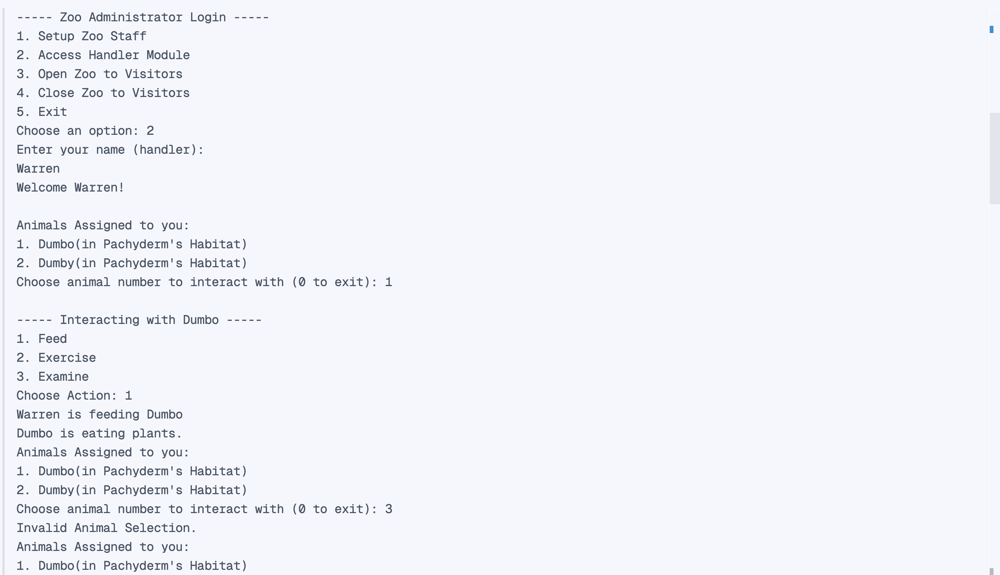
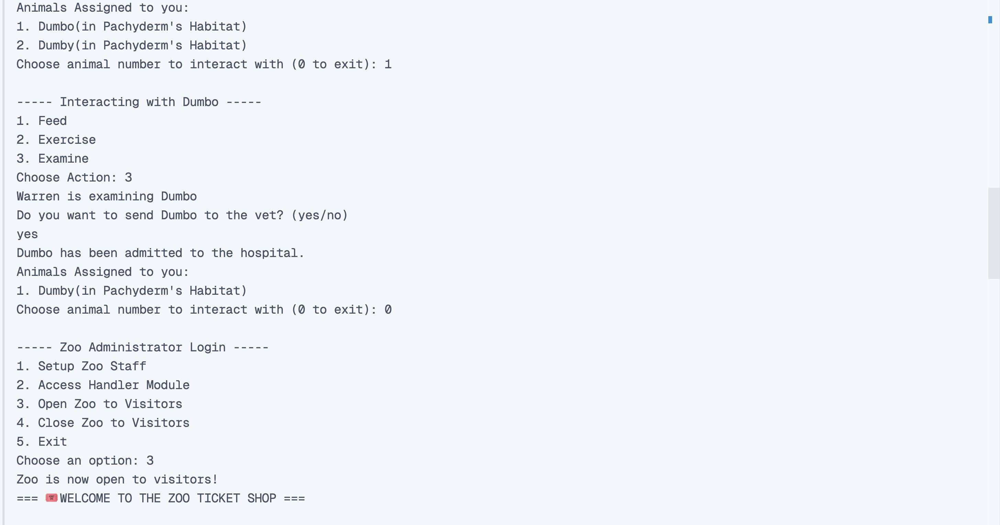
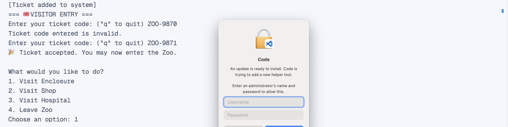
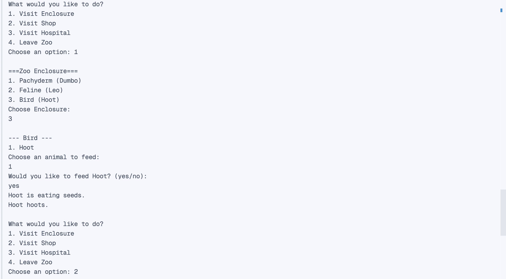
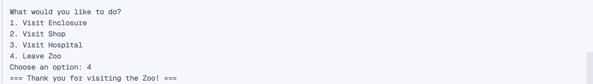

# Lab 1: Zoo Simulation

## Zoo Program

This project is a simple Zoo program built on Java that is based on a Unified Modeling Language Diagram.

### Features
**Zoo Administration Module**
 - Interactive text-based interface that allows Authorized Login with Zoo staff and settings configuration.
 - 
 - 
 - 

**Zoo Ticketing Module**
 - A user-friendly, console-based interaction for visitors to buy entry tickets to the Zoo, with varying prices depending on certain visitor conditions.
 - 
 - 
  
**Zoo Module**
 - A fully-guided console-based simulation interface that allows visitors to explore enclosures, shops, and the hospital of the Zoo.
 - 
 - 
 - 

### Members
- **Warren Denzel Cheng**
- **Godfrey Angelo Convento**
- **Jahren Hans Dayag**